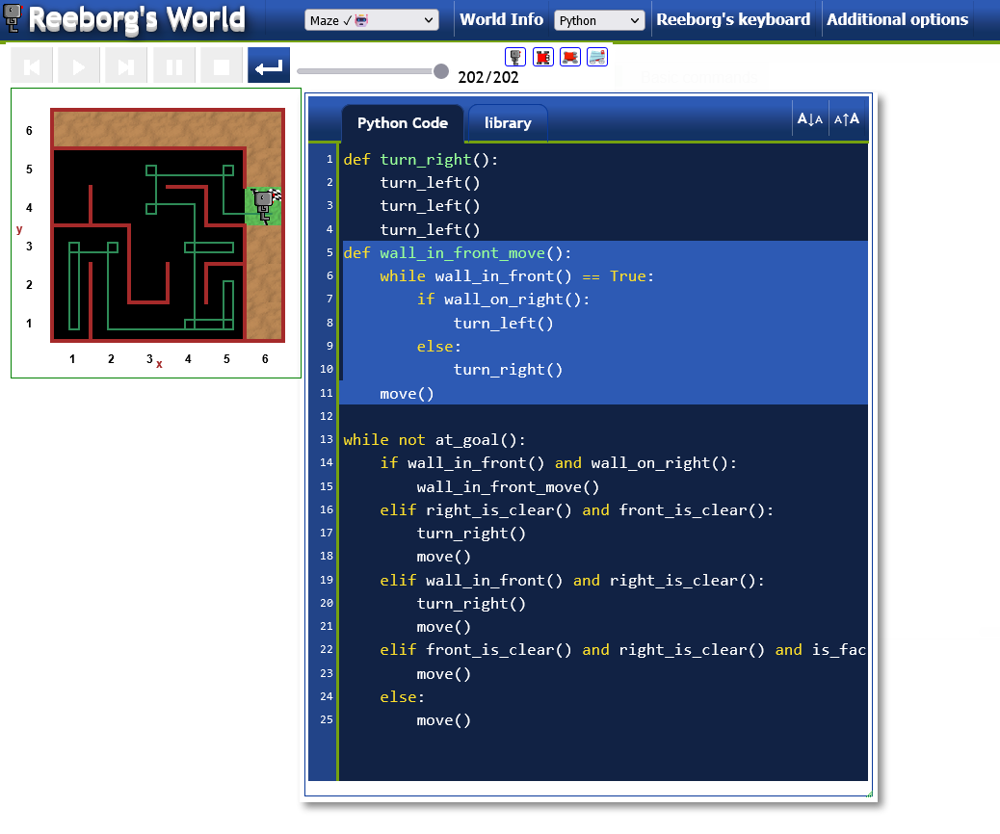

# Reeborg Maze Completetion
This solution can be used [here](https://reeborg.ca/reeborg.html?lang=en&mode=python&menu=worlds%2Fmenus%2Freeborg_intro_en.json&name=Maze&url=worlds%2Ftutorial_en%2Fmaze1.json)

The bot will complete the map in under 300 steps. Need to refine it for less steps hopefully.

